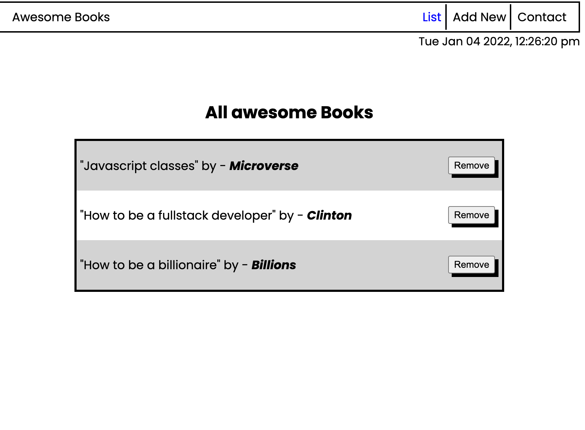

# Awesome books app plain

"Awesome books" is a simple website that displays a list of books and allows you to add and remove books from that list. see how to manage data using JavaScript. built with medium-fidelity wireframe for UI.

## Built With

- HTML
- CSS
- Javascript
- HTML&CSS Linter
- Git

[LIVE DEMO LINK](https://clintonjosephs.github.io/awesome-books-es6/)

## Get Started

Please get your browser update.
To get a local copy up and running follow these simple steps.

Run the command below from the Terminal:

      git clone <URL> in your terminal

      cd awesome-books-es6

      start index.html

## Authors

👤 **Clinton Mbonu**

- Location: Nigeria
- GitHub: [@clintonjosephs](https://github.com/clintonjosephs)
- Twitter: [@clintonmbonu_](https://twitter.com/clintonmbonu_)
- LinkedIn: [LinkedIn](https://linkedin.com/in/clinton-mbonu)

👤 **Ola Ishola**

- GitHub: [@netman5](https://github.com/netman5)
- Twitter: [@Orlaish](https://twitter.com/Orlaish)
- LinkedIn: [LinkedIn](https://www.linkedin.com/in/ola-ishola/)

👤 **Tekle Gebreyohannes**

- GitHub: [@githubhandle](https://github.com/gtekle)
- LinkedIn: [LinkedIn](www.linkedin.com/in/tekle-gebreyohannes-kidanemariam-7605752b)

## 🤝 Contributing

Contributions, issues, and feature requests are welcome!

## Show your support

Give a ⭐️ if you like this project!

## Acknowledgments

Microverse Community

## 📝 License

This project is [MIT](LICENSE) licensed.
