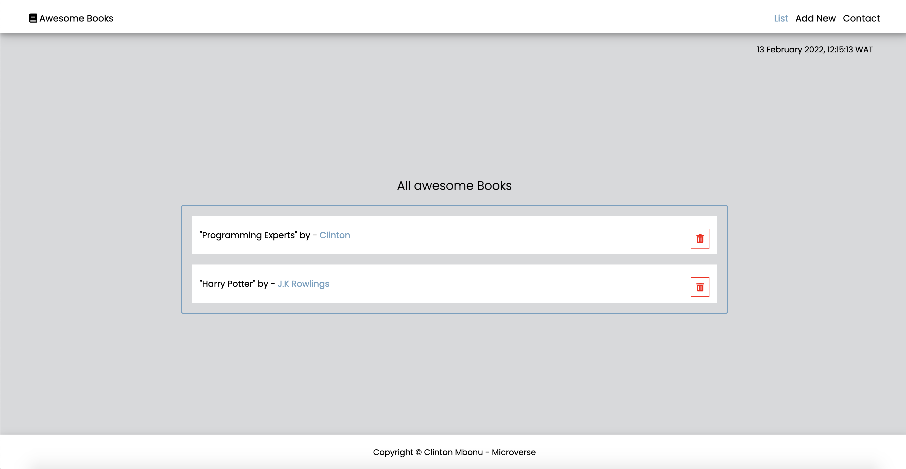

# Awesome Bools.

"Awesome books" is a simple website that displays a list of books and allows you to add and remove books from that list. See how to manage data using JavaScript.

```
Desktop and Mobile design implemented
```



## Built With

- Major Languages (HTML, CSS, JavaScript)
- Frameworks (No frameworks used)
- HTML&CSS Linters
- Git (Version control)

[LIVE DEMO LINK](https://clintonjosephs.github.io/awesome-books-es6/)


## Get Started
To get a local copy up and running follow these simple steps.

## Prerequisites
A text editor(preferably Visual Studio Code)

### Install
  -  [Git](https://git-scm.com/downloads)
  -  [Node](https://nodejs.org/en/download/)

Run the command below from the Terminal:

      git clone git@github.com:clintonjosephs/awesome-books-es6.git in your terminal

      cd awesome-books-es6

      Run npm install to install dependecies

      start index.html

## Authors

👤 **Clinton Mbonu**

- Location: Nigeria
- GitHub: [@clintonjosephs](https://github.com/clintonjosephs)
- Twitter: [@clintonmbonu\_](https://twitter.com/clintonmbonu_)
- LinkedIn: [LinkedIn](https://linkedin.com/in/clinton-mbonu)

## 🤝 Contributing

Contributions, issues, and feature requests are welcome!

## Show your support

Give a ⭐️ if you like this project!

## Acknowledgments

Microverse Community

## 📝 License

This project is [MIT](LICENSE) licensed.
